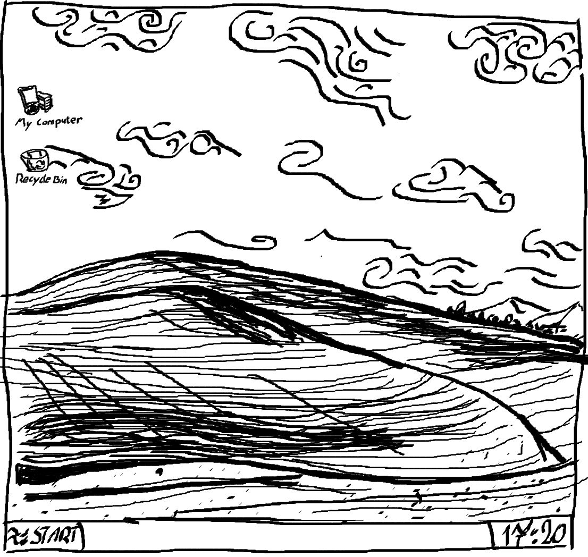

# Title
[< Go to TOPIC TITLE](path/to/previous.md)

## Related topics and concepts
- [Concept 1](https://...) - short note
- [Concept 2](https://...) - short note
- [Concept 3](https://...) - short note

## Summary
A short overview of the topic.

### Key ideas
- Idea 1
- Idea 2
- Idea 3



| Implementation | Usage | Time Average | Time Worst | Space Worst |
| --- | --- | --- | --- | --- |
| Option A | Use cases | $O(n\log n)$ | $O(n^2)$ | $O(n)$ |
| Option B | Use cases | $O(n\log n)$ | $O(n^2)$ | $O(n)$ |

```cpp
#include <bits/stdc++.h>
using namespace std;

int main() {
    ios::sync_with_stdio(false);
    cin.tie(nullptr);

    cout << "Hey Hi Hello\n";
}
```

## Basic problems
- [Problem name](https://...) - solution: [link](solutions/example.cpp)

## Additional problems
- [Problem name](https://...)

[Go to TOPIC TITLE >](path/to/next.md)
